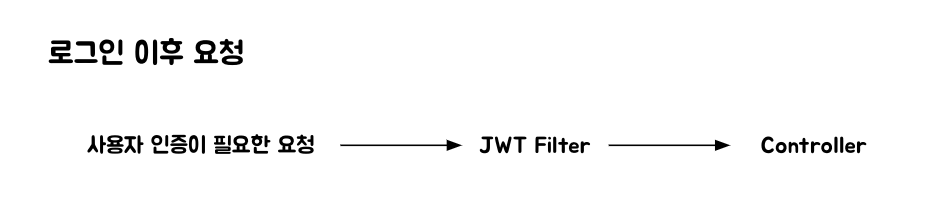

이번 포스트에서는 Spring Security를 사용하면서 JWT를 이용한 인증을 구현할 때 어떤 흐름으로 인증이 진행이 되고 토큰이 사용되고 발급되는지 알아 보려고 한다.  일단 Spring Security를 공부하면서 Form로그인에 대해서 많이 듣고 공부했을텐데 JWT로그인과 Form로그인은 Spring Security안에서 다르게 동작함을 인지해야 한다.

일반적인 id, password를 가지고 사용자 인증을 하는 Form 기반 로그인 방식은 Spring Security Config에서 http.formLogin();관련 설정을 한다.  이렇게 됐을 때 로그인 요청이 들어오면 자동으로 UsernamepasswordAuthenticationFilter로 빠지게 돼서 사용자 검증, 예외처리, Security Context에 저장 등 기능을 자동으로 수행해주어서 별도의 로그인 관련 서비스 로직이 불 필요하다.  하지만 JWT 기반 로그인 방식에서는 config 파일에서 http.formLogin(form -> form.disable()); 이렇게 form로그인 처리를 disable 하게 된다. 그러면 UsernamepasswordAuthenticationFilter가 동작을 하지 않게 되고 사용자 검증 ~ Security Context에 저장하는 커스텀 서비스 로직이 필요하게 된다.  정리하면 아래 그림과 같은 흐름을 타게 된다.

로그인이 성공하고 나면 헤더에 JWT를 담아서 return 해주게 되는데, 이후 사용자는 인증이 필요한 모든 요청에 대해서 헤더에 JWT토큰을 담고 서버로 요청을 보내게 된다.  서버에서는 헤더에 담긴 JWT가 유효한지에 대한 Filter를 만들어서 검증을 하면 된다.

