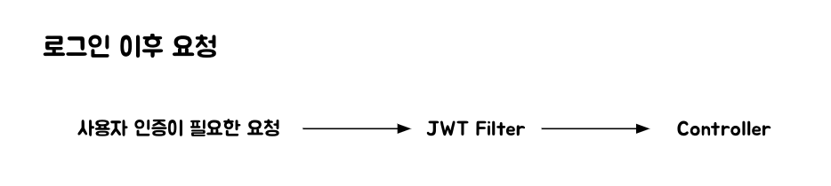

Spring Security에서 폼 기반 로그인(/login)요청을 처리할 때 UsernamePasswordAuthenticationFilter를 사용하게 되는데 이 필터에서 사용자 인증이 어떤 흐름으로 동작하는지 정리해보려고 한다.  아래 이미지는 로그인 요청의 흐름을 대략적으로 나타낸 것이다.


## 1. 클라이언트 요청
- 사용자가 로그인 폼에 username, password를 입력하고 로그인 요청을 보낸다. - 이 요청은 서버의 로그인을 담당하는 컨트롤러로 전송될 것이다.
```shell
POST /login HTTP/1.1 Content-Type: application/x-www-form-urlencoded  username=user123&password=pass123 
```

## 2. UsernamepasswordAuthenticationFilter 동작
- 1번에서의 로그인 요청은 해당 필터가 가로챈다. - 이후 attemptAuthentication() 메소드를 통해 username과 password만 들어있는 AuthenticationToken 객체를 생성한 뒤 AuthenticationManager에게 요청을 위임한다.
```java
@Override public Authentication attemptAuthentication(HttpServletRequest request, HttpServletResponse response)         throws AuthenticationException {     if (this.postOnly && !request.getMethod().equals("POST")) {         throw new AuthenticationServiceException("Authentication method not supported: " + request.getMethod());     }     String username = obtainUsername(request);     username = (username != null) ? username.trim() : "";     String password = obtainPassword(request);     password = (password != null) ? password : "";     UsernamePasswordAuthenticationToken authRequest = UsernamePasswordAuthenticationToken.unauthenticated(username,             password);     // Allow subclasses to set the "details" property     setDetails(request, authRequest);     return this.getAuthenticationManager().authenticate(authRequest); }
```
## 3. AuthenticationManger (ProviderManager)
- 사용자의 자격 증명을 검증하는 역할을 한다. - AuthenticationManger는 인터페이스이기 때문에 이를 구현한 ProviderManager가 구현체로 사용된다. - ProviderManager는 여러 provider들을 필드로 가지고 있다. 내부 로직으로는 여러 provider 중 어떤 것이 현재 인증에 맞는지 확인 한 뒤 사용자 검증을 한다.

## 4. AuthenticationProvider
- ProviderManager에서 선택된 Provider에서 실제 사용자의 인증을 확인한다. - 여러 Provider들이 있지만 (RememberMeAuthenticationProvider, AnonymousAuthenticationProvider 등..) 보통 아이디와 패스워드로 인증을 요청할 때는 DaoAuthenticationProvider가 사용된다. - 해당 Provider 안에서 loadUserByUsername()메소드를 호출하여 UserDetailsService를 통해서 DB 또는 다른 저장소에서 사용자 검증을 한다.
```java
UserDetails loadedUser = this.getUserDetailsService().loadUserByUsername(username);
```

- 조회한 사용자 정보와 요청들어온 비밀번호를 `PasswordEncoder`를 통해서 검증한다.
```java
String presentedPassword = authentication.getCredentials().toString(); if (!this.passwordEncoder.matches(presentedPassword, userDetails.getPassword())) {     this.logger.debug("Failed to authenticate since password does not match stored value");     throw new BadCredentialsException(this.messages.getMessage("AbstractUserDetailsAuthenticationProvider.badCredentials", "Bad credentials")); }
```
 - 성공 시 인증된 Authentication 객체를 반환한다.
## 5. Security Context
- 인증에 성공했을 경우 UsernamepasswordAuthenticationFilter의 successfulAuthentication()메소드가 호출된다. - 이 메소드 안에서 Security Context에 사용자의 인증 정보가 저장된다.


