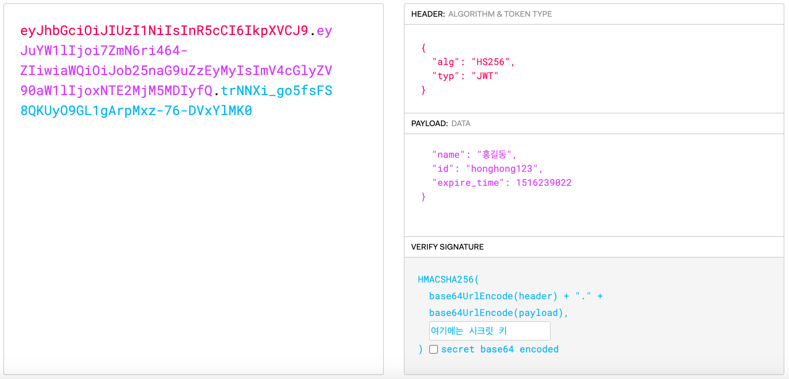

웹 개발을 하면서 사용자 인증 방식을 구현하는 방법에는 크게 session을 이용한 방법과 jwt를 이용한 두가지 방법이 있다. (쿠키는..제외..)

전통적으로 session을 이용한 사용자 인증 방식을 많이 사용했지만 내가 운영하는 서비스나 서버 상태에 따라서 사용자 인증을 session을 사용할지 JWT를 사용할지는 각각의 장단점이 확실히 존재하기에 잘 고민해봐야 하는 부분인 것 같다.
## 📌 Session

이미지에서처럼 세션 인증 방식은 사용자의 인증 정보를 서버에서 직접 관리를 하게 된다.

이렇게 서버에서 직접 관리하기 때문에 보안성은 높지만 사용량이 많아질수록 서버의 부하가 많이 갈 수 있다는 단점이 있다.

그렇지만 비교적 간단하게 구현할 수 있고, 강제 로그아웃 처리가 쉽다는 장점이 존재한다.

또한 Scale-out으로 서버 여러 대가 존재할 시 세션을 공유해야 하는 작업이 추가된다. 이에 경우에는 세션을 사용한 인증 방식보다는 JWT를 사용하는 방식이 더 효율적일 것이다.

## 📌 JWT (Json Web Token)

JWT는 서버가 사용자의 로그인 정보를 토큰(JSON방식)으로 변환하여 클라이언트에 전달하는 방식이다. 이후 클라이언트는 헤더에 이 토큰을 포함하여 요청을 보내고 서버에서는 이 토큰을 검증하는 방식이다.

JWT는 아래와 같이 3가지 구조로 구성된다.

여기에 접속하면 아래와 같이 JWT토큰을 만들어 볼 수 있다.

JWT를 이용한 사용자 인증 방식은 요청을 보낼 때마다 요청에 담긴 토큰을 이용해서 사용자 인증을 진행하기 때문에 서버 확장성이 용이하다. 그리고 서버가 사용자의 상태를 저장하지 않기 때문에 서버의 부담이 적다는 특징이 있다.
## 정리

